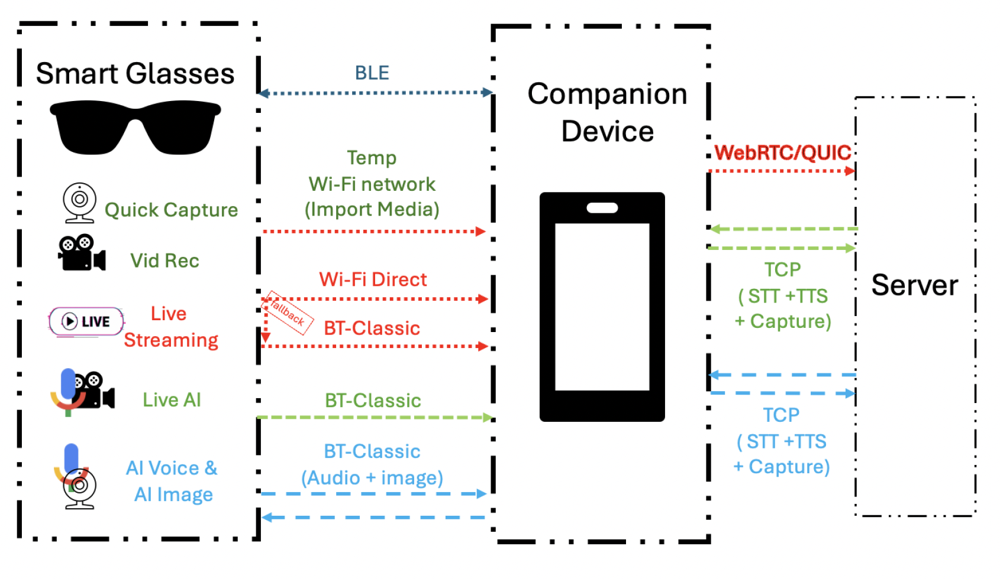

# Eyes and Ears on the Edge: Dissecting Multimodal Traffic Dynamics in XR and AI Glasses

<p align="center">
  
</p>

<p align="center">
  <em>System architecture showing communication protocols between Smart Glasses, Companion Device, and Server across different operational modes.</em>
</p>

---

## 📋 Overview

This repository contains the official implementation and supplementary materials for our paper:

> **"Eyes and Ears on the Edge: Dissecting Multimodal Traffic Dynamics in XR and AI Glasses"**  
> *Anonymous Authors*  
> IMC '26

We present a comprehensive measurement study analyzing the multimodal traffic dynamics of modern XR and AI-powered smart glasses. Our work dissects the network communication patterns across various operational modes, revealing insights into the interplay between local processing, companion device offloading, and cloud-based AI services.

---

## 🏗️ System Architecture

Our study examines the complete communication stack of smart glasses ecosystems:

### Smart Glasses Features
| Feature | Description |
|---------|-------------|
| **Quick Capture** | Instant photo capture functionality |
| **Vid Rec** | Video recording capabilities |
| **Live Streaming** | Real-time video broadcast to remote servers |
| **Live AI** | Interactive AI-powered visual assistance |
| **AI Voice & AI Image** | Multimodal AI processing (speech + vision) |

### Communication Protocols

#### Smart Glasses ↔ Companion Device
- **BLE (Bluetooth Low Energy)**: Control signaling and metadata exchange
- **Temp Wi-Fi Network**: High-bandwidth media import
- **Wi-Fi Direct**: Primary channel for live features (with BT-Classic fallback)
- **BT-Classic**: Audio streaming and image transmission for AI features

#### Companion Device ↔ Server
- **WebRTC/QUIC**: Low-latency live streaming to cloud
- **TCP (STT + TTS + Capture)**: Speech-to-text, text-to-speech, and capture services for AI features

---

## 📁 Repository Structure (actual)

The repository is organized by measurement area. Top-level items you will find in this copy are:

```
ai_voice_image_interaction/           # Audio & image AI interaction latency/throughput notebooks, CSVs, and plots
distance_power_logcat/                # Distance and power measurement data and notebooks (logcat outputs)
live_ai_interaction/                  # Meta AI data, notebooks and generated plots for live AI interaction tests
live_video_streaming-conferencing/    # Live streaming & conferencing notebooks, CPU/utilization and throughput-latency data + plots
power_tests/                          # Additional power test data and scripts
transmission_power_algorithm_Data     # Adaptive transmission power algorithm Data and Notebook
workflow.png                            # System architecture diagram
dragon/                   # Proprietary in-house application framework for Dragon Smart glasses
README.md                             # This file
```

Notes:
- Each analysis folder typically contains Jupyter notebooks and a `Plots/` subfolder where exported images are stored.
- See the folder-level READMEs (for example `live_ai_interaction/README.md` and `live_video_streaming-conferencing/README.md`) for folder-specific run instructions and figure-to-notebook mappings.

---

## 🚀 Quick Start — regenerate plots (notebooks)

### Prerequisites

- Python 3.8+ recommended
- Typical Python libraries used across notebooks: `pandas`, `numpy`, `matplotlib`, `seaborn`, `openpyxl`

Install the common packages with:

```bash
python -m pip install pandas numpy matplotlib seaborn openpyxl
```

### Running notebooks

All plots are produced by running Jupyter notebooks located inside the analysis folders. Example workflow:

1. Change to the folder containing the notebook you want to run, e.g.:

```bash
cd live_ai_interaction/Meta_AI_Data
```

2. Start Jupyter or open the notebook in VS Code and run all cells:

```bash
jupyter notebook Meta_AI_Bitrate_Plot_Notebook.ipynb
# or open it in VS Code and press "Run All"
```

3. The notebook will save generated figures in the folder's `Plots/` directory (or an adjacent `Plots/` folder). See each folder README for exact output filenames and figure numbers.


---

## 📈 Reproducibility

To reproduce figures and tables, run the notebooks or helper scripts found in the relevant analysis folder. Notebooks are designed to load local CSV/Excel/PCAP inputs from the same directory or a `data/` subfolder — inspect the first code cell to adjust paths if necessary.


---

## 📝 Citation

If you find this work useful, please cite our paper:

```bibtex
@inproceedings{anonymous2026eyes,
  title={Eyes and Ears on the Edge: Dissecting Multimodal Traffic Dynamics in XR and AI Glasses},
  author={Anonymous},
  booktitle={Proceedings of the ACM Internet Measurement Conference (IMC)},
  year={2026}
}
```

---

## 📄 License

This project is licensed under the MIT License - see the [LICENSE](LICENSE) file for details.

---

## 🙏 Acknowledgments

We thank the anonymous reviewers for their valuable feedback. This work was supported by [Institution/Grant details to be added after review].

---

## 📧 Contact

For questions or issues, please open a GitHub issue or contact the authors (contact information will be provided after the anonymous review process).

---

<p align="center">
  <b>⭐ Star this repository if you find it useful! ⭐</b>
</p>